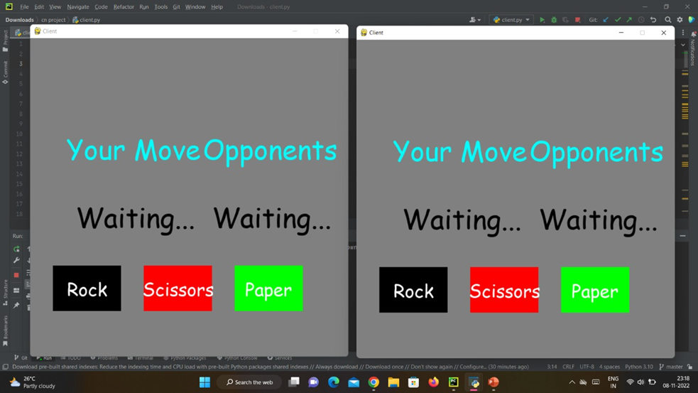

# Multiplayer Rock-Paper-Scissors

A multiplayer Rock-Paper-Scissors game built in Python using Pygame and Sockets. This project demonstrates real-time network programming by pairing connected clients to play the classic game against each other over a network.

## Project Structure

- `server.py`: The socket server that pairs clients, manages game states, and orchestrates matches.
- `client.py`: The Pygame client application with the game's user interface.
- `network.py`: The client-side networking logic that communicates with the server.
- `game.py`: The core game logic determining match state, wins, and moves.

## How to Run Locally

1. Run the server:
   ```bash
   python server.py
   ```
2. Run two separate instances of the client:
   ```bash
   python client.py
   ```
3. Play against yourself (or another person on the same machine) across the windows!

## Screenshots / UI Output

Here are some screenshots of the game in action:




## Conclusion and Future Work

In conclusion, our project has successfully implemented a multiplayer Rock-Paper-Scissors game using socket programming, opening the door to real-time gaming experiences. It underscores the potential of networked gaming and the collaborative nature of modern programming. This project offers a starting point for further advancements in online gaming, demonstrating the exciting possibilities of interactive multiplayer experiences in a connected world.

### Future Enhancements

1. Scalability for more players.
2. User authentication and profiles.
3. Chat feature for player interaction.
4. Enhanced user interface.
5. Leaderboards for competition.
6. Game variations and modes.
7. Mobile app development.
8. Network security.
9. AI opponents for single-player mode.
10. Gameplay statistics and analytics.
11. Player customization options.
